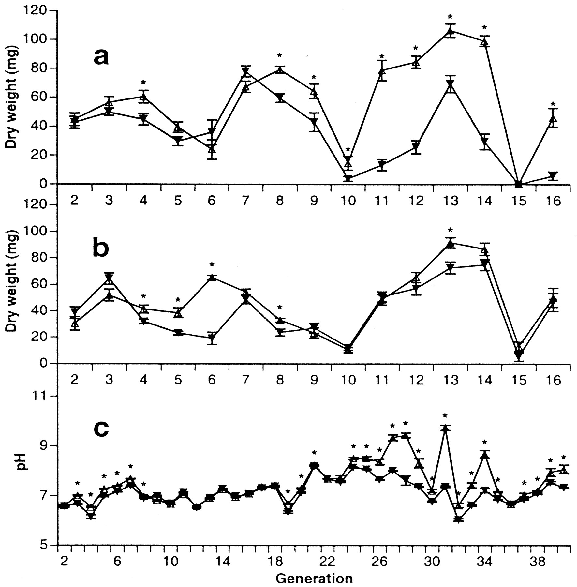
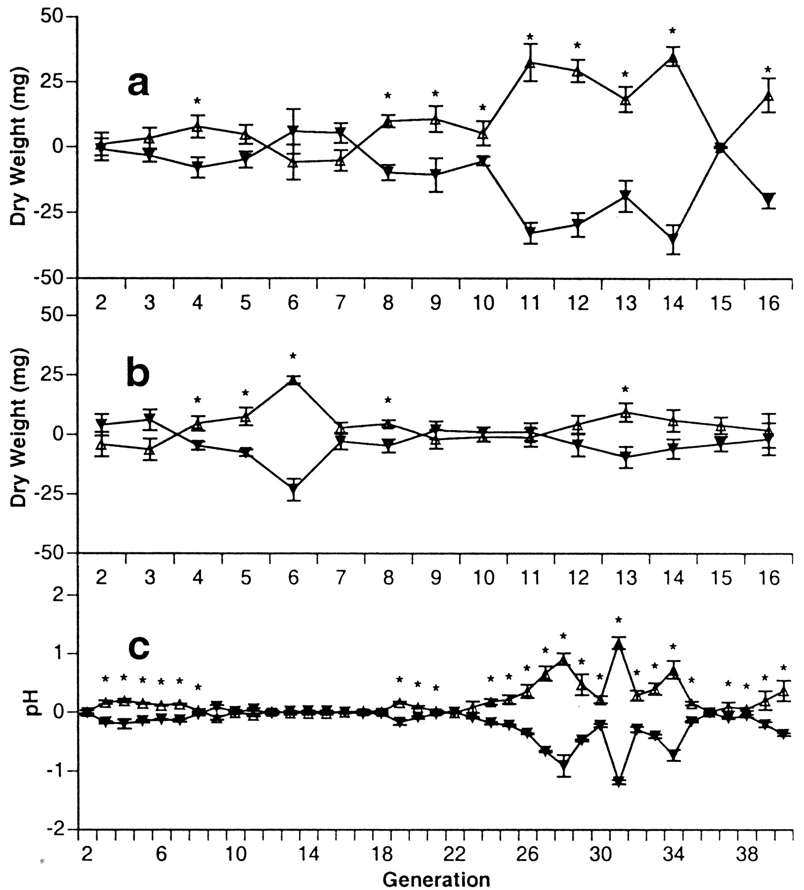
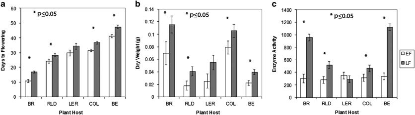
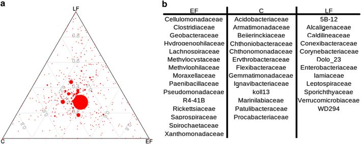
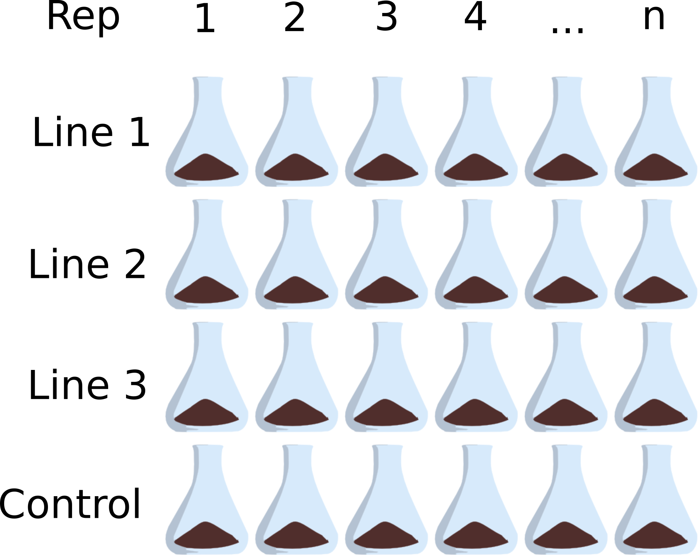

```{r setup, include=FALSE}
knitr::opts_chunk$set(
	echo = FALSE,
	message = FALSE,
	warning = FALSE
)
library(pwr)
```

## What I'm hoping to get out of this

- Feedback and criticism on questions and experimental design
- Identifying any pitfalls: In 6 months what will I be thinking "Dang, I wish I had done that."?
- Your ideas about how to think about the results I might get
- Statistical approaches to analyzing the results


## Overarching Question

- How do the members of a microbial community relate to the functions their ecosystem exhibits?

- How can we use genetic information to understand ecosystem function?

- What members of the community are statisticaly correlated with a particular function?

- Why might those taxa be controlling function?


## Approaches to structure-function studies

> - **Comparative approach**
>     - Sample a natural gradient in process rate and compare the communities along that gradient.
> - **Manipulative approach**
>     - Alter the microbial community by testing specific combinations of microbes.
>     - Label the substrate and measure the community that incorporates the label (SIP, BrdU).
> - **Experimental approach**
>     - Create many replicate communities and select the top performers to inoculate the next generation.


- Sampling along a natural gradient imposes a problem of covariation with other aspects of the environmet.
- By incubating replicate communities under virtually identical conditions and selecting for the particular function of interest 
- Randomization at the community level breaks the association between confounding variables and our explanatory variables of interest.
- Plus, replication across multiple lines could potentially break up correlations between taxa that are unrelated to the process


## Artificial Ecosystem Selection

```{r, fig.align='center', fig.width=1}
knitr::include_graphics("emi_140_f1.png")
```

Swenson, W., J. Arendt, and D. S. Wilson. 2000. Artificial selection of microbial ecosystems for 3-chloroaniline biodegradation. Environmental Microbiology 2:564–571.

- Create many replicate communities with variation in the microbiota
- Measure the function you're selecting on
- Take the top performers and use them to inoculate the next generation
- Variation is introduced through bottlenecks or subsampling effects on the community
- Akin to a quantitative genetics study where you would take backcross F1s to see what variation in the genome is correlated with variation in a quantitative trait


# Examples of Artificial Ecosystem Selection

## Artificial Ecosystem Selection

- Selected on plant biomass in soil and pH in aquatic microbiota
- Did not look at the microbes
- Found samples separated by soil nutrients (NH4+) (1st Discriminate function)
- Circles are controls, triangles are selected


```{r, fig.align='center'}

```


Swenson, W., D. S. Wilson, and R. Elias. 2000. Artificial ecosystem selection. Proceedings of the National Academy of Sciences 97:9110–9114.


## Response to selection

```{r, fig.align='center'}

```

Swenson, W., D. S. Wilson, and R. Elias. 2000. Artificial ecosystem selection. Proceedings of the National Academy of Sciences 97:9110–9114.


- High/low plant biomass
- Two transmission rates: 0.6 g and 6.0 g
- High/low aquatic pH


## Selection on soil microbiomes reveals reproducible impacts on plant function

- Selected on early/late flowering time
- Found reproducible effect on multiple species
- Found no differences in nutrients, but nitrogen enzyme activity was greater
- They did not test the effect of nitrogen additions

```{r, fig.align='center'}

```

Panke-Buisse, K., A. C. Poole, J. K. Goodrich, R. E. Ley, and J. Kao-Kniffin. 2015. Selection on soil microbiomes reveals reproducible impacts on plant function. The ISME Journal 9:980–989.


## Community analysis

```{r, fig.align='center'}

```


Panke-Buisse, K., A. C. Poole, J. K. Goodrich, R. E. Ley, and J. Kao-Kniffin. 2015. Selection on soil microbiomes reveals reproducible impacts on plant function. The ISME Journal 9:980–989.


## The actual study

No immigration and (assuming) speciation will be negligible.
Control should be entirely drift (and selection for surviving passage).
Experimental should be drift + selection (experimental drift = control drift).

### I expect changes in the community to be:

1. Changes in relative abundance of taxa
2. Changes in intraspecific variation in traits

### Why replicate lines?
1. Potential to separate correlations between taxa that are unrelated to oxidation rates
2. Reproducibility in selection: do the same taxa respond?

##

### Control
One line with neutral selection (random reps inoculate the next gen)

## Pilot Study

```{r, fig.align='center'}

```


## Things to test with a pilot study

- Is there a response to selection?
- What transmssion rate is sufficient to see a response to selection?
- Do selection on forest and wetland soils result in different responses/communities? 
    - i.e. To what extent does the initial community impact the response to selection?

## Plan

- Soils from West Eugene Wetlands
- 8 bottles per line
- 4 lines
- Each line with different transmission rate (0.1%, 1%, 10%)
- 1 control line
- Maybe a follow-up with 1 transmission rate and separate Wetland/Forest lines to see whether source affects the response to selection


# Analysis

## Detecting a significant change in oxidation rates

- ANOVA to compare individual lines with control
- Repeated Measures ANOVA if I want to incorporate all generations in this test
- Power analysis with $\alpha$ = 0.05, power = 1 - $\beta$ = 0.8, and n = 8 suggests I would need to see a 75% increase in oxidation rates in the experimental line over the control line to detect an effect.

## Community analysis

- Differentially abundant taxa 
