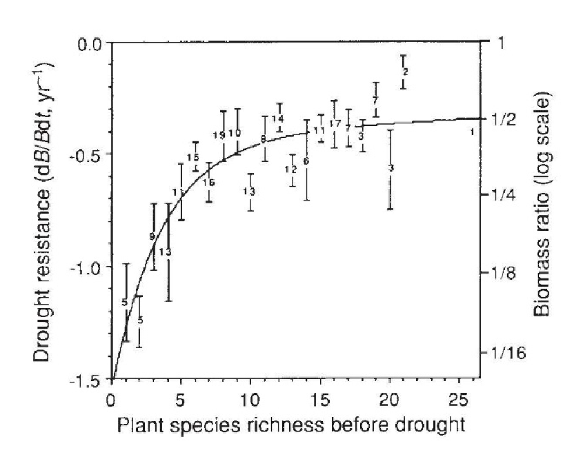
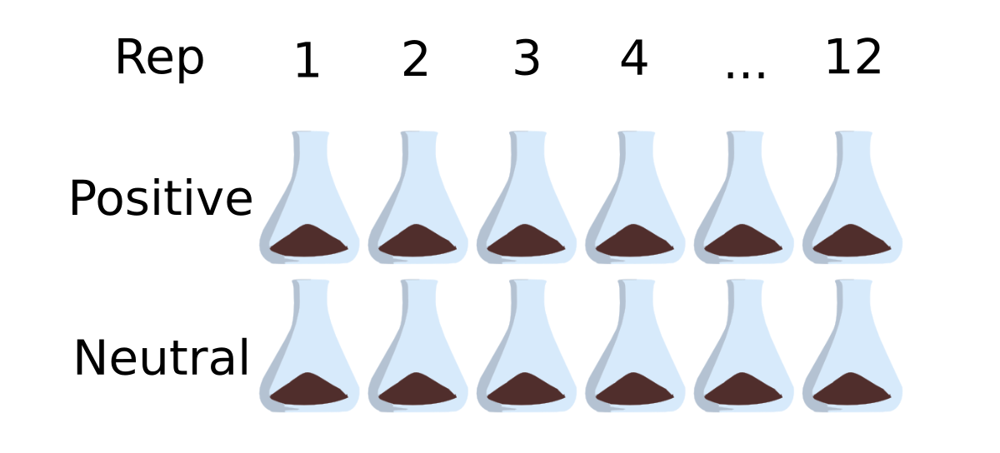

```{r setup, include=FALSE}

knitr::opts_chunk$set(echo = FALSE, message = FALSE)
library(tidyverse)
library(metafor)
library(morris)
library(broman)
```

## What I'm hoping to get out of this

- Practice talking about why I'm doing what I'm doing and what we can learn from it.
- Hear your questions and comments that might guide future steps.
- Talk about what "heritability" means in a community context.

# How does biodiversity influence ecosystem function?

## One approach
Relating alpha diversity within a functional group to the *rate* or *stability* of an ecosystem function

```{r, fig.width=4, fig.height=3, out.width=6e2*.8, out.height=4.5e2*0.8}

```

## Reasons this works

1. There's a clear unit of biological organization - the species. 
2. It's obvious what a "plant" is.
3. Communities are relatively simple (1-25 species).

## Limitations of microbial community data

  1. No consistent species concept.
  2. What's a plant?
  3. Diversity can be 100s to 10,000s.

## An alternative conceptualization of communities

A community is a pool of genes analogous to a genome (the metagenome) and that community exhibits a phenotype (ecosystem function).

Thinking about it this way, an ecosystem function might exhibit similar properties to an organismal trait.


$V_P = V_G + V_E$

## Heritability is "the relative importance of heredity in determining phenotypic values" 

"A character can be 'hereditary' in the sense of being **determined by
the genotype**[1] or in the sense of being **transmitted from parents to offspring**[2]."

[1] Broad-sense heritability,  $H^2 = V_G / V_P$

[2] Narrow-sense heritability, $h^2 = V_A / V_P$

<small>Falconer and MacKay, 1996</small>

# An alternative approach to linking microbial communities to ecosystem function

## Artificial Ecosystem Selection

1. Generate lots of communities with different combinations of taxa.
2. Put them into a common environment to minimize environmental variation.
3. Test which combinations generate the greatest function.
4. Reshuffle the best communities and test again.
5. Investigate which taxa respond to selection.

## Design

```{r, fig.width=4, fig.height=3, out.width=9e2*0.8, out.height=4.5e2*0.8}

```

# Is there a response to selection at the ecosystem level on soil methane oxidation rate? 

##

```{r, fig.width=4, fig.height=3, out.width=6e2, out.height=4.5e2}

fluxes <- read_tsv('../Output/fluxes.tsv')
ggplot(fluxes, aes(x = passage, y = estimate, color = treat)) + 
  geom_jitter() +
  scale_color_manual(name = 'Treatment', labels = c('Neutral', 'Positive'),
                     values = c('gray60', 'darkorange2')) +
  labs(x = "Passage", y = 'Methane Oxidation Rate (-k)') +
  theme_classic()

```

##

```{r, fig.width=4, fig.height=3, out.width=6e2, out.height=4.5e2}

fluxes %>% 
  select(treat, passage, estimate) %>% 
  group_by(passage, treat) %>% 
  summarize(mean = mean(estimate),
            se = se(estimate)) %>% 
ggplot(mapping = aes(x = passage, y = mean, ymin = mean - se, ymax = mean + se,
                     color = treat)) + 
  geom_pointrange() +
  scale_color_manual(name = 'Treatment', labels = c('Neutral', 'Positive'),
                     values = c('gray60', 'darkorange2')) +
  labs(x = "Passage", y = 'Methane Oxidation Rate (-k)') +
  theme_classic()
```

## Community composition impacts the rate of this ecosystem function

<style>
.container{
    display: flex;
}
.col{
    flex: 1;
}
</style>

<div class="container">

<div class="col">
```{r, fig.width=4, fig.height=3, out.width=6e2*0.8, out.height=4.5e2*0.8}

deviance <- read_tsv('../Output/deviance.tsv')
dev_fit <- readRDS('../Output/dev_fit.rds')
dev_pred <- predict(dev_fit)
passages <- length(deviance$passage)

ggplot(deviance, aes(x = passage, y = deviance, ymin = deviance - se, ymax = deviance + se)) + 
  geom_ribbon(aes(ymin = dev_pred$ci.lb, ymax = dev_pred$ci.ub), alpha = 0.2) +
  geom_pointrange(color = 'darkorange2') + 
      geom_segment(aes(x = 1, xend = passages, y = dev_fit$beta[1] + dev_fit$beta[2], yend = dev_fit$beta[1] + dev_fit$beta[2]*passages), color = 'darkorange2', size = 1) +
  labs(x = "Passage Number", y = "Deviation from Control (P - N)")+
  theme_classic()

```
</div>

<div class="col">
```{r}
init <- 
  fluxes %>% 
  group_by(passage) %>% 
  summarize(mean = mean(estimate)) %>% 
  filter(passage == 1) %>% 
  pull()

init_se <- 
  fluxes %>% 
  group_by(passage) %>% 
  summarize(se = se(estimate)) %>% 
  filter(passage == 1) %>% 
  pull()
```


There was a response to selection on soil methane oxidation rate in the positive treatment relative to the neutral treatment.

z = `r myround(dev_fit$zval[2], 2)`, p = `r myround(dev_fit$pval[2], 3)` 

slope = `r myround(dev_fit$beta[2], 3)` $\pm$ `r myround(dev_fit$se[2], 3)`

(initial mean flux  = `r myround(init, 3)` $\pm$ `r myround(init_se, 3)`)
</div>

</div>


# How *heritable* is soil methane oxidation rate as an ecosystem trait?


## Broad- vs. Narrow-sense heritability

$V_G/V_P$ is the extent to which phenotype is determined by the genotype.

$V_A/V_P$ is the extent to which phenotype is determined by the genes transmitted from the parents.

## Broad- vs. Narrow-sense heritability

$V_G/V_P$ is the extent to which phenotype is determined by the genotype.

**$V_A/V_P$ is the extent to which phenotype is determined by the genes transmitted from the parents.**

## Narrow-sense heritability

$h^2 = R / S$

$R$ = Response to selection, difference between parents and offspring

$S$ = Selection differential, difference between selected parents and all parents

```{r}
h2_per_gen <- read_tsv('../Output/h2_per_gen.tsv')

h2_per_gen_sum <-
  h2_per_gen %>% 
  group_by(treat) %>% 
  summarize(h2_med = median(h2), h2_mad = mad(h2), .groups = 'drop')
```


## Half of the variation in methane oxidation rate is attributable to the additive effect of genes passed from the parents


Positive: `r as.numeric(myround(h2_per_gen_sum$h2_med[2], 2))` 
$\pm$
`r as.numeric(myround(h2_per_gen_sum$h2_mad[2], 2))`

Neutral: `r as.numeric(myround(h2_per_gen_sum$h2_med[1], 2))` 
$\pm$
`r as.numeric(myround(h2_per_gen_sum$h2_mad[1], 2))`

The remainder is due to
environmental variation not controlled for experimentally or with the neutral
treatment, interactions among taxa, ...?

Caveat: $h^2$ may be affected by correlated traits also under selection.

## Heritability for the positive and neutral lines

<style>
.container{
    display: flex;
}
.col{
    flex: 1;
}
</style>

<div class="container">
<div class="col">
```{r, warning=FALSE, fig.width=4, fig.height=3, out.width=6e2*0.8, out.height=4.5e2*0.8}
ggplot(h2_per_gen, aes(x = passage, y = h2, color = treat)) +
  geom_point() +
  labs(x = 'Passage Number', y = expression(paste("Narrow-sense Heritability (",
                                                h^2, ")"))) +
  scale_color_manual(name = 'Treatment', labels = c('Neutral', 'Positive'),
                     values = c('gray60', 'darkorange2')) +
  theme_classic()

```


</div>

<div class="col">


```{r, warning=FALSE, fig.width=4, fig.height=3, out.width=6e2*0.8, out.height=4.5e2*0.8}
ggplot(h2_per_gen, aes(x = passage, y = h2, color = treat)) +
  geom_point() +
  labs(x = 'Passage Number', y = expression(paste("Narrow-sense Heritability (",
                                                h^2, ")"))) +
  scale_color_manual(name = 'Treatment', labels = c('Neutral', 'Positive'),
                     values = c('gray60', 'darkorange2')) +
  theme_classic() +
  ylim(-0.683, 1.56)

```
</div>

</div>

# Which taxa respond to selection? Are correlated with flux?

## In progress:

- Sequencing *pmoA* to characterize the diversity of methane oxidizers.
- Sequencing 16S to look broadly at bacterial/archaeal taxa.

