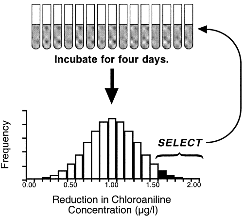

```{r setup, include=FALSE}
knitr::opts_chunk$set(
	echo = FALSE,
	message = FALSE,
	warning = FALSE
)
library(pwr)
```


## What I'm hoping to get out of this

- Feedback and criticism on questions and experimental design
- Identifying any pitfalls: In 6 months what will I be thinking "Dang, I wish I had done that."?
- Your ideas about how to think about the results I might get
- Statistical approaches to analyzing the results

## Overarching Question

- How do the members of a microbial community relate to the functions their ecosystem exhibits?

- How can we use genetic information to understand ecosystem function?

- What members of the community are statisticaly correlated with a particular function?

- Why might those taxa be controlling function?


## Approaches to structure-function studies

> - **Comparative approach**
>     - Sample a natural gradient in process rate and compare the communities along that gradient.
> - **Manipulative approach**
>     - Alter the microbial community by testing specific combinations of microbes.
>     - Label the substrate and measure the community that incorporates the label (SIP, BrdU).
> - **Experimental approach**
>     - Create many replicate communities and select the top performers to inoculate the next generation.


## Artificial Ecosystem Selection

```{r, fig.align='center'}

```

## Slide with Plot

```{r pressure}
plot(pressure)
```

